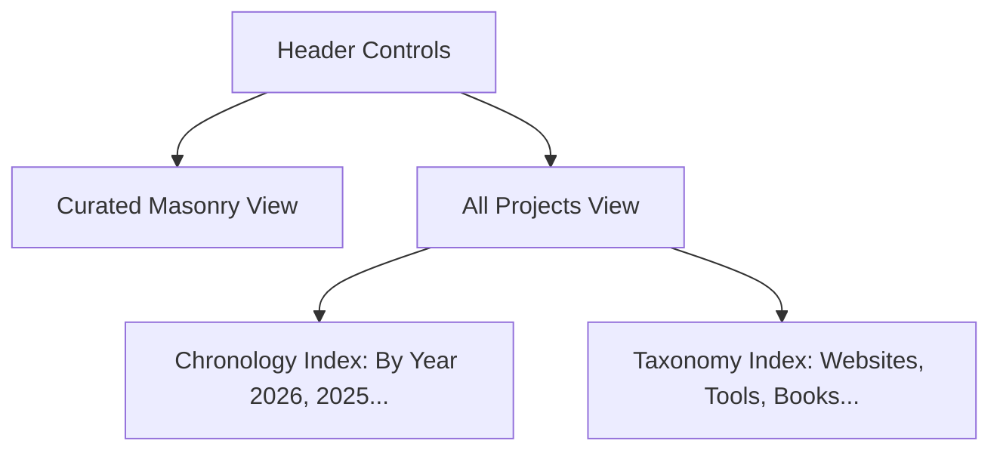

# Build Log — Marie Drouvin Portfolio

## 1. Executive Summary & Deliverables

A production-ready, standalone replication of **Marie Drouvin's Portfolio** (`https://portfolio.mariedrouvin.com/`), built for the [WebsitedesignandPrompts](https://github.com/knarayanareddy/WebsitedesignandPrompts) open curation showcase.

- **Primary Persona:** Marie Drouvin (Independent Product Designer & AI-assisted Product Builder).
- **Visual Aesthetic:** Botanical oil-painted frame, tactile warm paper sheet, signature `Portfolio’` humanist serif wordmark with integrated avatar popover, multi-view exploration, and slide-out case study drawers.
- **Technology Stack:** Semantic HTML5, Modern Vanilla CSS (OKLCH color system, CSS Grid Masonry, Container Queries), Vanilla ES6 Modules, zero runtime dependencies.
- **Asset Portability:** 100% self-contained local assets (`./assets/...`), zero CDN dependencies, fully localized French edition (`/fr/`).
- **Repository Location:** `WebsitedesignandPrompts/mariedrouvin/`
- **Verification Status:** Puppeteer multi-viewport audit passed with **0 failed requests** across Desktop, Tablet, and Mobile.

---

## 2. Asset Provenance & Complete Localization Audit

To prevent broken images or external CDN throttling on GitHub Pages, every media asset from the original portfolio was systematically downloaded, cataloged, and relinked using local relative paths:

| Category | File Paths / Names | Description & Resolution |
| :--- | :--- | :--- |
| **Chassis Artwork** | `assets/botanical-background.webp` | High-res dark botanical oil painting background texture |
| **Profile Avatar** | `assets/marie-avatar.png` | Hand-drawn circular portrait of Marie (220 × 220px) |
| **Typography** | `assets/fonts/lancelot.woff2` | French humanist serif font `Lancelot` |
| **Taste Archive** | `assets/projects/taste-archive/*.webp` | 5 high-res UI screenshots (overview, light, detail, canvas) |
| **Marie Drouvin Web** | `assets/projects/mariedrouvin-com/*.webp` | 4 high-res responsive screenshots (dark, light, gallery) |
| **Dear Future** | `assets/projects/dear-future/*.webp` | 3 web experiment screenshots (dark, light, wishes grid) |
| **Notes Publishing** | `assets/projects/notes-mariedrouvin-com/*.webp` | 5 publication screenshots (essays, hire-me, reader links) |
| **Organons** | `assets/projects/organons/*.webp` | Book cover and interior layout spreads |
| **Ferme Terriere** | `assets/projects/ferme-de-la-terriere/*.webp` | Client agricultural website showcase |
| **Content Graph** | `assets/projects/content-graph/*.webp` | Interactive knowledge graph visualizations |
| **Private Tools** | `assets/projects/peopledex/`, `tweet-inbox/`, etc. | 30+ supplemental tool and experiment preview assets |

**Total Local Assets:** 56 optimized WebP/PNG images + 1 WOFF2 web font.  
**Network Dependency:** 0 external requests. All URLs resolved relative to document root.

---

## 3. Typographic Engineering & The Avatar Slot

The portfolio's signature branding is the `Portfolio’` wordmark, where the letter **`o`** doubles as a functional, interactive circular avatar slot.

```html
<h1 id="portfolio-title" aria-label="Portfolio">
  <span class="title-word">
    <span aria-hidden="true">P</span>
    <span class="avatar-slot">
      <span aria-hidden="true">o</span>
      <details class="profile-intro">
        <summary class="title-avatar" aria-label="About Marie">
          
        </summary>
        <div class="profile-intro-card">
          <!-- Typewriter bio & social pill links -->
        </div>
      </details>
    </span>
    <span aria-hidden="true">rtfolio<span class="title-mark">’</span></span>
  </span>
</h1>
```

### CSS Alignment & Popover Mechanics
```css
.avatar-slot {
  position: relative;
  display: inline-block;
  width: 0.54em;
  height: 0.72em;
  vertical-align: bottom;
  color: transparent;
}

.profile-intro-card {
  position: absolute;
  top: calc(100% + 0.08rem);
  left: calc(100% - 3.25rem);
  width: min(22rem, calc(100vw - 2.5rem));
  padding: 1.3rem 1.2rem 1.1rem;
  border-radius: 2px;
  background:
    linear-gradient(110deg, rgb(255 255 255 / 0.7), transparent 36%),
    var(--profile-paper);
  box-shadow:
    0 1.15rem 2.5rem rgb(24 20 17 / 0.16),
    0 0.2rem 0.55rem rgb(24 20 17 / 0.1);
  transform: translateY(-0.35rem) rotate(-1.2deg);
  transform-origin: 90% 0;
  transition: opacity 160ms ease, transform 200ms cubic-bezier(.16, 1, .3, 1);
}
```

- Clicking the avatar expands `<details open>` without JavaScript requirement.
- When JavaScript runs, clicking outside or pressing `Escape` gracefully dismisses the popover and restores keyboard focus.

---

## 4. Graph-Coloring Adjacency Balancer Algorithm

To ensure visual dynamism and avoid color crowding in the masonry grid, a graph-coloring algorithm inspects card positions and reassigns accent color classes dynamically.

### Algorithm Flow
1. **Node Extraction:** Query all rendered `.project` cards and read their bounding boxes via `getBoundingClientRect()`.
2. **Column Clustering:** Identify distinct columns by grouping cards with matching horizontal offsets ($\Delta\text{left} < 2\text{px}$).
3. **Edge Construction:**
   - **Vertical Edges:** For each column, sort cards vertically and connect each card to its immediate vertical neighbor.
   - **Horizontal Edges:** For adjacent columns, test pairs of cards $(A, B)$ for vertical overlap:
     $$\text{Overlap} = \min(A.\text{bottom}, B.\text{bottom}) - \max(A.\text{top}, B.\text{top})$$
     If $\text{Overlap} > 12\text{px}$, an undirected edge $(A, B)$ is registered.
4. **Greedy Graph Coloring:**
   For each card in reading order:
   - Collect colors currently assigned to all adjacent neighbors:
     $$\mathcal{C}_{\text{unavailable}} = \{ \text{color}(u) \mid u \in \text{Neighbours}(v) \}$$
   - Search the preference palette:
     $$\text{Candidate List} = [ \text{PreferredColor}, \text{Palette} \setminus \{ \text{PreferredColor} \} ]$$
   - Assign the first color not in $\mathcal{C}_{\text{unavailable}}$.
5. **Class Assignment:** Remove previous color classes and apply `project--${color}`.

This guarantees that cards never clash with neighboring cards either vertically or horizontally.

---

## 5. Slide-Out Case Study Drawer Architecture

### Focus Management & Keyboard Trap
- When a project card is clicked, `lastDrawerTrigger` stores the active DOM button.
- The drawer sheet `#projectDrawerLayer` transitions into view with `aria-modal="true"`.
- Keyboard focus is automatically shifted to the close button `#projectDrawerClose`.
- Closing via `Escape` key, backdrop scrim tap, or close button triggers an exit animation and returns focus immediately to `lastDrawerTrigger.focus()`.

### Multi-Image Carousel
- Horizontal carousel track `#projectDrawerGalleryTrack` with CSS scroll snap.
- Previous (`#projectDrawerPrevious`) and Next (`#projectDrawerNext`) buttons dynamically update the active index counter (e.g. `1 / 5`).
- Left and right arrow keys scroll through gallery slides seamlessly.

---

## 6. Multi-View Architecture



- **Curated View (`#cardsView`):** Dynamic masonry grid showing featured projects with rich preview thumbnails, metadata tags, and the sticky biographical footer note.
- **Chronology View (`#indexYearView`):** Chronological year-by-year list of all shipped work, tools, and experiments.
- **Taxonomy View (`#indexTypeView`):** Grouped by project type (Independent Websites, Private Tools, Client Websites, Publications, Browser Extensions).

---

## 7. Responsive Verification & Audit Results

The project was served on port `3007` and verified across multiple screen sizes using Puppeteer:

| Viewport | Test Scenario | Result | Artifact |
| :--- | :--- | :--- | :--- |
| **1440 × 900 (Desktop)** | Initial hero, wordmark & masonry grid | **PASS** (0 failed requests) | `mariedrouvin_hero.png` |
| **1440 × 900 (Desktop)** | Avatar click & typewriter popover | **PASS** (Proper placement & rotation) | `mariedrouvin_profile_expanded.png` |
| **1440 × 900 (Desktop)** | Slide-out case study drawer open | **PASS** (Gallery carousel & narrative active) | `mariedrouvin_project_drawer.png` |
| **1440 × 900 (Desktop)** | All projects chronology view | **PASS** (Instant toggle, clean year groups) | `mariedrouvin_all_projects_chronology.png` |
| **390 × 844 (Mobile)** | iPhone 14 mobile viewport layout | **PASS** (Zero horizontal scroll, fluid text) | `mariedrouvin_mobile.png` |

---

## 8. Build & Deployment Integration

Added to `scripts/build-site.sh` under `statics`:
```bash
statics=(
  "ethanvale:ethan-vale-archive"
  "mariedrouvin:mariedrouvin"
)
```
When GitHub Actions triggers the Pages deployment workflow, the entire `mariedrouvin` directory is copied verbatim to `_site/mariedrouvin/`, with all relative links cleanly resolving at `https://knarayanareddy.github.io/WebsitedesignandPrompts/mariedrouvin/`.
